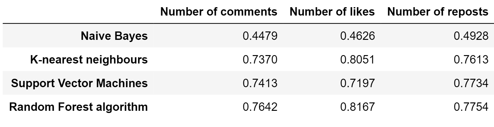
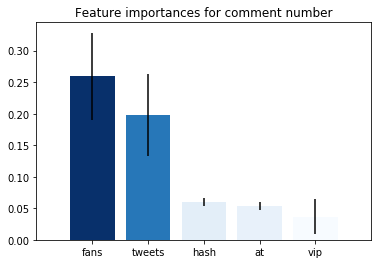
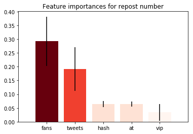
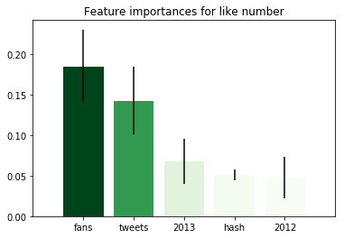

# News popularity prediction based on the data from Weibo

**by Sissi Wang, Tingyi Li, Yijia Xue**

names by the alphabetical order of the last names

## Introduction

####  Problem description

Micro Blog (Weibo in Chinese), namely a blog with concise content, is an emerging service among social media which facilitates internet users to set up real-time information sharing and communication communities. Sina Weibo has become the biggest social media platform in China as a leading figure since its establishment in 2009. According to Sina’s official data, with surging growth rate, Sina Weibo has over 523 million monthly active users by October 2020 (Sina, 2020) .

Consequently, analyzing the publication of news on Sina Weibo has the typical meaning for the investigation in expanding channels of news dissemination, acceleration of news transmission, and the changing pattern of news edition and gathering（Huang, 2017).

#### Goals

Motivated by the phenomenon in information era that social media is subtly changing the pattern of news dissemination, we develop this project aiming to: Correctly classify a piece of news based on its content; Find out and select the properties that stand for the popularity of a microblog as well as appropriate tags that may affect the popularity of a microblog news; Find proper algorithm to predict the popularity of a piece of new based on the selected tags; Determine the most important tags

#### Achivements

In this project, we reach the achievements of: 

- Do **words segmentation** with manually-selected stop words, and cluster the news into 10 classes through TF-IDF calculation; according to our clustering result, predict the class of a piece of news based on its content; 
- Clean the dataset and select 31 tags (fans number, VIP level, tweets number, at number, hash number, has video or not, has image or not, original or not, publish year, publish time, and news type); 
- Predict the popularity (repost number, like number and comment number) with the Naive Bayes algorithm, K-nearest **Neighbor algorithm**, **Support Vector Machines algorithm**, and **Random Forest algorithm**, and compare the scores of accuracy; 
- Understand and adjust the code of the most suitable algorithm (Random Forest), **transforming it into the version that only uses basic python libraries**, including Numpy and Pandas, which are friendly to new programmers; 
- Find out the five most important tags that determine the popularity of a weibo news respectively for **like number**, **comment number**, and **repost number**.

## Results

According to the algorithm of the random forest above, our adjusted code for the random forest algorithm achieves satisfactory accuracy scores (see below Table)

The accuracies of the baseline models are shown below:

According to our algorithm, the top 5 tags that contribute to the like number in sequence are: **fans number, tweets number, the year 2013, hash number and the year 2012**. The top 5 tags that contribute to the comment number in sequence are: **fans number, tweets number, vip level, hash number and at number**. The top 5 tags that contribute to the repost number in sequence are: fans number, tweets number, vip level, hash number and at number (see below Figure). In summary, fans number, tweets number, vip level, hash number and at number contribute a lot to the prediction model.

## Conclusion

In all, we made clustering of the news type based on its content and built a model to predict the popularity of a Weibo. We also find the 5 most important tags for the prediction. Here is a conclusion of the strength and weakness of our model, and advice for the new media operation.

## References

Malcolm, G. (2002). The Tipping Point how Little Things Can Make a Big Difference. Back Bay Books.

Xiong, X., Li, Y., Qiao, S., Han, N., Wu, Y., Peng, J., & Li, B. (2018). An emotional contagion model for heterogeneous social media with multiple behaviors.* Physica A,* 490, 185-202. doi:10.1016/j.physa.2017.08.025

Rongying, Z. (2014). Research on Influencing Factors of Information Dissemination in Micro-blog. Information Studies: Theory & Application, 3.